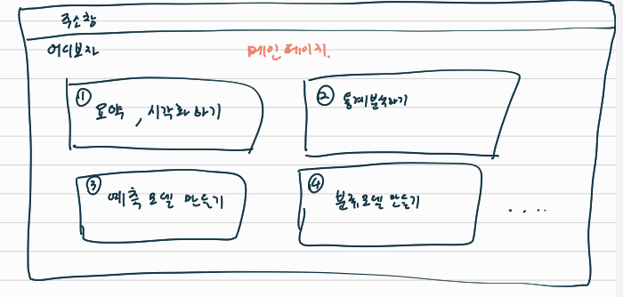
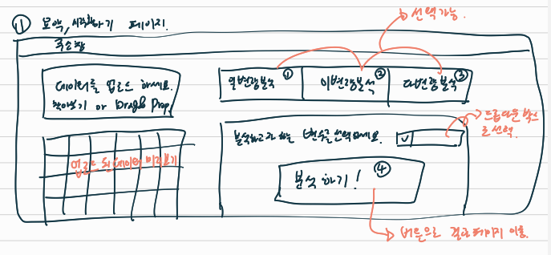
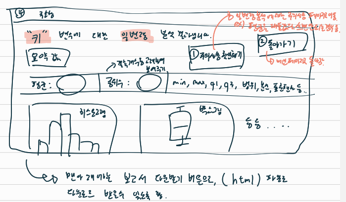

# 어디보자(Look)

## 프로젝트 계획 이유

 시간이 지날 수록 데이터의 중요성은 강조되고 있고, 기업, 학교, 공공기관뿐 아니라 개인들도 자신들의 데이터를 적극적으로 활용하고, 데이터를 통해 얻은 인사이트로 영업 전략, 정책, 행동 패턴 등 다양한 것들을 결정합니다. 이러한 시대에서 데이터를 분석하고 이를 통해 직관을 얻는 역량은 정말 중요하다고 할 수 있습니다. 

 그러나 그러한 역량을 얻는 것은 생각보다 쉽지 않은 일이며, 많은 시간을 필요로 합니다. 그래서 우리는 생각합니다. 데이터를 분석하고, 결과를 보여주기 까지의 필요한 과정은 어떤 것들이 있는지, 어떤 가정이 필요하며, 어떤 우려가 있는지는 우리가 고민하겠습니다. **데이터와 질문만 있다면 누구든지 무료로 쉽게 결과를 얻을 수 있도록 하는 오픈소스 프로젝트**를 시작하려합니다. 

## 프로젝트 개요

사용 언어 : Python

배포 방식 : Python을 활용한 웹 어플리케이션

웹 어플리케이션을 위한 패키지 : Flask

보고서 생성 양식 : markdown, notion? (미정)

시각화 도구 : matplotlib, seaborn, plotly ? (미정)

버전 관리 시스템 : GitHub

패키지 관리 도구 : npm

테스트 : ? (미정)

배포 : Azure, AWS, Netlify, Vercel, Heroku ? (미정)

개인정보 보호와 메모리 관리를 위해, 업로드 된 데이터는 30분에 한번씩 자동 삭제하려 함

## 개발 계획

1. 웹을 먼저 만들고, 틀을 잡은 뒤에 기능 개발 시작
2. 일변량 -> 이변량 -> 다변량 순으로 개발하며, 이변량 까지 개발이 되면, 웹서버에 호스팅할 예정
3. 우선은 요약 값과 시각화 중심으로 개발 예정이며, 이후 통계분석, 회귀, 분류, 딥러닝 등 점차 기능을 확장할 예정

주어질 데이터를 알 수 없어서 Kaggle의 [House price prediction](https://www.kaggle.com/datasets/shree1992/housedata)데이터가 주어졌다고 생각하고, 프로토타입을 개발하려고 계획

## UI(예상도)

### 메인 화면

### 요약, 시각화하기 페이지

### 결과 보고서 페이지

